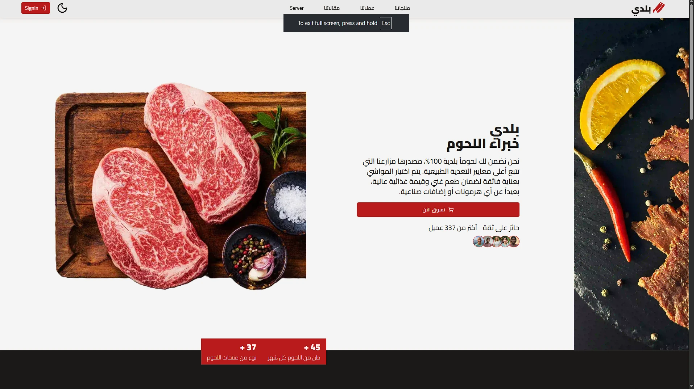

# 🛒 BALADY - Next-Generation E-commerce Architecture



**BALADY** هو مشروع متكامل يمثل الجيل القادم من منصات التجارة الإلكترونية، تم بناؤه باستخدام **React 19** و **Next.js 16**. المشروع ليس مجرد متجر، بل هو نظام هندسي (Engineering System) يركز على الأداء العالي، الأمان الفائق، ودمج تقنيات الذكاء الاصطناعي.

## 🛠️ الـ Stack التقني (Advanced Tech Stack)

تم اختيار الأدوات بعناية لضمان أقصى كفاءة:

* **Frontend & Core:** `React 19` (إصدار مستقر) مع `Next.js 16` (App Router).
* **State Management:** `Zustand` لإدارة الحالة بكفاءة وخفة.
* **Forms & Validation:** استخدام `@conform-to/react` مع `Zod` لتوفير تجربة Type-safe كاملة من الـ Client إلى الـ Server Actions.
* **Backend & DB:** `PostgreSQL` مع `Prisma ORM` واستخدام `extension-accelerate` لتحسين سرعة الاستعلامات.
* **AI Integration:** دمج `LangChain` مع `Google GenAI` لبناء وكلاء ذكاء اصطناعي (AI Agents) مخصصين للتجارة.
* **Authentication:** الإصدار الأحدث من `Next-Auth (v5 Beta)` مع `Prisma Adapter`.
* **UI/UX:** نظام مكونات مبني على `Radix UI` و `Tailwind CSS 4.0` مع دعم الـ Dark Mode عبر `next-themes`.

## 🏗️ المعمارية الهندسية (Engineering Architecture)

المشروع مبني على مبادئ **Clean Code** و **Modular Design**:

1. **Server Actions First:** اعتماد كامل على Server Actions لإدارة البيانات، مما يقلل من حجم الـ JavaScript في المتصفح ويزيد الأمان.
2. **Strict Type-Safety:** استخدام `zod-prisma-types` لضمان تطابق أنواع البيانات بين قاعدة البيانات والواجهة الأمامية تلقائياً.
3. **Complex Form Handling:** إدارة النماذج المعقدة (مثل إضافة المنتجات المتعددة) باستخدام `Conform` لضمان عدم وجود أخطاء في الـ Runtime.
4. **Reliability:** نظام اختبارات متكامل باستخدام `Vitest` لضمان جودة الـ Logic الخاص بالعملات، الضرائب، والخصومات.

## 🌟 المميزات التقنية المتقدمة

* **AI-Powered Search & Support:** نظام دردشة ذكي مبني بـ LangChain لفهم احتياجات العميل واقتراح المنتجات.
* **Optimized Images:** دمج `Uploadthing` لإدارة رفع الصور بكفاءة مع تحسين تلقائي للأحجام.
* **Real-time Analytics:** رسوم بيانية تفاعلية باستخدام `Recharts` لمتابعة أداء المبيعات.
* **Enterprise Seeding:** نظام Seeding احترافي باستخدام `Faker.js` لتوليد آلاف البيانات التجريبية لاختبار الأداء (Stress Testing).

## 🚀 التشغيل والتطوير

```bash
# تثبيت الاعتماديات (Dependencies)
npm install

# إعداد قاعدة البيانات والـ Migration
npx prisma generate
npx prisma db push

# تشغيل نظام الـ Seed لتوليد بيانات تجريبية
npx prisma db seed

# تشغيل بيئة التطوير
npm run dev
# balady-mastra
