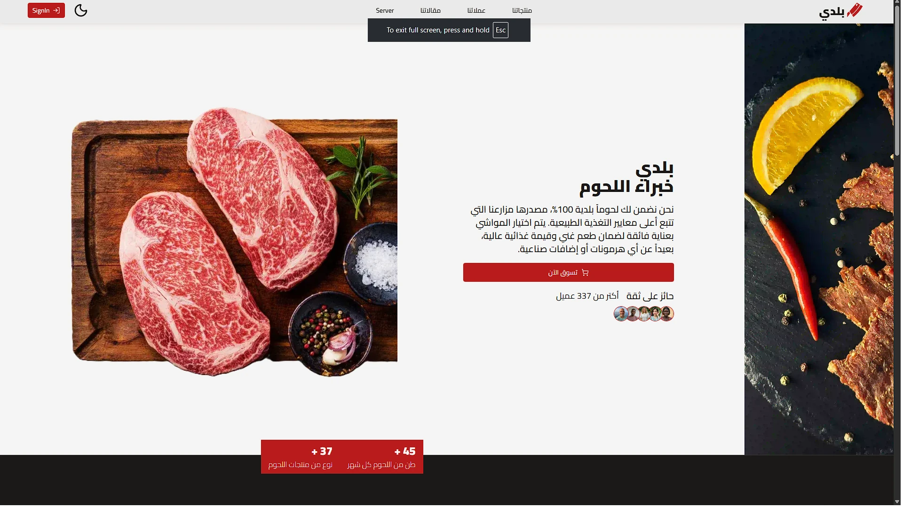

# Balady | بلدي

## The Intelligent Marketplace for Premium Local Meat

Balady is a modern, AI-enhanced marketplace built for premium local meat products. It brings together a polished shopping experience, intelligent agents, smooth animations, and powerful admin tools in one cohesive platform. The project is designed to make buying fresh, high-quality meat feel more personal, trustworthy, and seamless.

---

## About the Project

Balady combines e-commerce, business management, and artificial intelligence into a single experience. Customers can explore products, interact with an AI assistant, and enjoy a modern storefront, while administrators can manage farms, cattle, breeds, yields, users, and products with a clean and structured workflow.

---

## Key Features

- AI-powered assistant for product guidance, recommendations, and conversational support.
- Smart marketplace experience with a modern UI and responsive design.
- Admin-friendly management for farms, cattle, breeds, yields, products, and users.
- Interactive charts and business insights for better decision-making.
- Rich media support for product and content experiences.
- Smooth motion and polished transitions for a premium user experience.
- Strong data validation and secure authentication for reliable platform operations.

---

## Technology Stack

### Core Web & Frontend

- Next.js 16 for performance-focused full-stack development.
- React 19 for modern, interactive UI building.
- TypeScript for safer and more maintainable code.
- Tailwind CSS for fast, utility-first styling.
- shadcn/ui and Radix UI for accessible, beautiful component primitives.
- Lucide React and other UI libraries for clean icons and visual polish.

### UI, Motion & Experience

- Framer Motion for elegant animations and fluid transitions.
- Recharts for interactive data visualizations.
- Sonner and related UI utilities for feedback and notifications.

### AI & Intelligence

- Mastra for building agents, tools, workflows, memory, and observability.
- AI SDK for conversational AI integrations.
- LanceDB and DuckDB for vector search and retrieval-based experiences.
- Ollama-based AI providers and streaming rendering tools for rich assistant responses.

### Backend & Data

- Prisma ORM for type-safe database access.
- PostgreSQL as the relational database layer.
- NextAuth for authentication and secure sessions.
- Zod for schema validation and form safety.
- UploadThing for file and image uploads.
- Zustand for lightweight client-side state handling.

### Development & Quality

- ESLint for code quality.
- Vitest for unit testing.
- Playwright for browser-based testing and automation.
- tsx and TypeScript tooling for fast local development.

---

## Why I Chose This Stack

### Next.js 16

I chose Next.js 16 because it gives a powerful foundation for building modern full-stack applications with excellent performance, routing, server-side capabilities, and a strong developer experience. It is ideal for a project that needs both a polished frontend and backend logic in one unified framework.

### React 19

React 19 was the natural choice for creating a highly interactive user interface. Its modern rendering model and improved developer ergonomics make it a great fit for dashboards, dynamic forms, and AI-driven experiences.

### Tailwind CSS + shadcn/ui

Tailwind CSS allows rapid UI development with a consistent design system, while shadcn/ui provides a high-quality set of accessible, reusable components. Together, they make it easy to create a premium-looking interface without sacrificing flexibility or speed.

### Framer Motion

Framer Motion helps bring the product to life with smooth transitions, micro-interactions, and polished animations. This is especially valuable in a marketplace experience where subtle motion can make the interface feel more refined and engaging.

### Mastra

Mastra is one of the most exciting parts of this project because it makes AI agents, tools, workflows, and memory feel structured and production-ready. It is a strong fit for building an intelligent assistant that can reason, use tools, and participate in multi-step processes instead of acting like a simple chatbot.

### Prisma + PostgreSQL

Prisma offers a modern, type-safe way to interact with the database, while PostgreSQL provides a reliable and scalable relational database for managing products, users, inventory, and business data.

### NextAuth + Zod

NextAuth makes authentication simple and secure, while Zod ensures that data is validated consistently across the app. This creates a safer and more reliable experience for both users and administrators.

### Additional Modern Tools

I also chose Zustand for simple and scalable client state, UploadThing for media handling, Recharts for business analytics, and Vitest/Playwright to keep the project maintainable as it grows.

---

## Project Highlights

- A premium local-meat marketplace experience with a modern visual identity.
- An AI assistant that adds a differentiated layer of intelligence to shopping.
- A flexible architecture that supports both customer-facing and admin-facing workflows.
- A strong balance between aesthetics, performance, and developer productivity.
